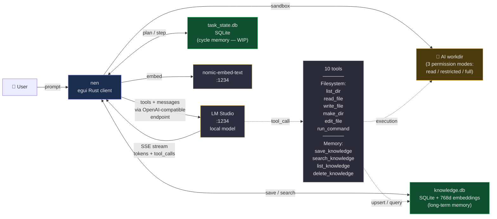

# 灯 miyabi

**Desktop chat client in Rust for LM Studio, with tool calling and persistent vector memory.**

> *miyabi (雅)* — the aesthetic ideal of the Japanese Heian court (794–1185), root of 雅楽 *gagaku* (classical court music still played today at the Imperial Palace). It denotes the refined elegance of technique so mastered that it returns to simplicity. The project bears this name because it aims at **mastered simplicity** — small, local, understood, refined — rather than raw power or spectacle.

---

## Thesis

**A small, well-harnessed local model gets the job done. No need for a large cloud model.**

A 9B LLM (Qwen3.5, GLM-flash, Gemma, etc.) runs on a consumer GPU (e.g. RTX 3060 12 GB). Properly equipped with tools (sandbox, filesystem, shell, vector memory), guided by a minimal system prompt (targeted, not verbose), and following a context-offload pattern (extract → save → forget), it accomplishes 80–95 % of everyday assistance tasks.

This project demonstrates that **intelligent frugality** beats **raw power** for individual use. Zero cloud calls, zero telemetry, zero subscription. Everything lives on the user's machine.

---

## Functional architecture



---

## What works already (v10)

### 6 system tools (sandboxed workdir, 3 permission levels)

| Tool | Purpose | Cap |
|---|---|---|
| `list_dir(path)` | List a directory (skipping internal artifacts) | 200 entries |
| `read_file(path, start_line?, end_line?)` | Read a text file | 1 MB max |
| `write_file(path, content)` | Write a file, creates parents if needed | — |
| `make_dir(path)` | Recursively create a directory | — |
| `edit_file(path, old, new)` | Replace a unique string | — |
| `run_command(command)` | Execute a shell command | 30s timeout + taskkill |

### 4 vector memory tools

| Tool | Purpose |
|---|---|
| `save_knowledge(title, content, tags?)` | Embed (nomic-embed-text) → store in knowledge.db |
| `search_knowledge(query, limit?)` | Semantic search (pure Rust cosine similarity) |
| `list_knowledge(tag?)` | List entries, optional tag filter |
| `delete_knowledge(id)` | Delete an entry by id |

### Infrastructure

- **SSE streaming** token-by-token with robust parsing of fragmented `delta.tool_calls`
- **Path jail sandbox** via `check_access()` — canonicalize + verify workdir membership
- **3 permission modes**: read-only, restricted (read + write within workdir), full (with run_command)
- **Thought Flow panel** — structured reasoning visible in real time
- **Custom system prompt** loaded from `system_prompt.txt` (not versioned, kept private)
- **Auto-injection of workdir context** when tools are enabled
- **3 unit tests**: workdir filtering, knowledge.db schema (with embedding round-trip), task_state.db schema

---

## Decision branches in progress

### 🔀 Branch 1 — Cycle Agent pattern (WIP)

**Problem**: a small 9B LLM loses coherence as its context grows. Long chains of multiple tool calls eventually slip into textual XML format instead of the proper API call (observed behavior).

**Proposed solution**: split a complex task into atomic sub-steps, purging context between each. The LLM writes into `task_state.db` what it just did, purges, re-reads the state, executes the next step.

**State**: `task_state.db` schema in place (3 tables: tasks, steps, cycle_prompts) + `open_task_db()` functions. **4 tools still to wire**:
- `plan_task(description, steps[])`
- `step_done(step_id, findings)`
- `step_failed(step_id, error)`
- `task_done(task_id, summary)`

### 🔀 Branch 2 — Windows stdout encoding fix

PowerShell commands emitting UTF-8 produce double-mojibake (`Résultat` instead of `Résultat`). To fix by prefixing `[Console]::OutputEncoding = UTF8`.

### 🔀 Branch 3 — Model-agnostic design confirmed

The architecture is independent of the underlying LLM. Any OpenAI-compatible endpoint works without modification (LM Studio, Ollama, vLLM, SGLang). Tested on Qwen3.5-9B; to be benchmarked on GLM-4.7-flash and Gemma-4.

---

## Visual interface

`nen` is built with **egui** (pure Rust immediate-mode GUI, no Electron, no web tech). Every panel renders natively in ~10 MB of RAM.

### Layout overview

```
┌──────────────────────────────────────────────────────────────────────────────┐
│  ☰ Menu  │  Model: qwen3.5-9b ▾   Permissions: [R] [R+W] [Full]   ⚙ Settings │
├──────────────┬───────────────────────────────────────────────┬───────────────┤
│              │                                               │               │
│  SycoMeter   │                                               │   Thought     │
│  ▓▓▓░░ 58%   │            Chat / Conversation                │   Flow        │
│  flags:      │                                               │   panel       │
│   - adverbs  │   User prompt                                 │               │
│   - vague    │   > ...                                       │   🧠 Reasoning│
│              │                                               │   🔧 Tool call│
│  ─────────   │   Assistant response                          │   📁 list_dir │
│              │   > ... (streaming tokens)                    │   📄 read_file│
│  File tree   │                                               │   ✎ edit_file │
│  📁 workdir  │   [tool_call] list_dir(".")                   │   ✅ step_done│
│   ├ src/     │   [result]   [file] main.rs (180 KB)          │               │
│   ├ README   │                                               │               │
│   └ ...      │   ─────────────────────                       │   ─────────   │
│              │   [Textbox: your prompt]         [↑ Send]     │   Predictor   │
│              │                                               │   next type:  │
│              │                                               │   tool_call   │
│              │                                               │   or text     │
└──────────────┴───────────────────────────────────────────────┴───────────────┘
```

### Panels in depth

#### 🎚️ SycoMeter — sycophancy detector (left panel)
Measures how much the LLM response slips into flattery / verbal softening. A pure Rust heuristic scanning for:
- Empty adverbs ("*absolutely*", "*definitely*", "*certainly*")
- Vague super-praise ("*great question*", "*excellent point*")
- Hedging inflation ("*of course*, *indeed*, *clearly*")
- Reflected user words turned into compliments

Output: a **0–100 % bar** (color gradient: green → yellow → red) plus a list of detected flags. A model running too high regularly means its system prompt is pushing it toward servility — a concrete signal to rework the prompt.

An **EMA (exponential moving average) per model** is also tracked, so switching from Qwen to GLM or Gemma shows which one is most/least sycophantic in your actual usage.

#### 🧠 Thought Flow panel (right panel)
Renders the model's reasoning in a structured, sequential feed:
- **Reasoning blocks** — the "thinking" text before/during the answer
- **Tool calls** — each with name, arguments, result, exit status (✅ / ❌)
- **Result previews** — first lines of file reads, command output, knowledge matches
- **Step markers** — in Cycle Agent mode (WIP), visualizes plan → step done / step failed → next

Gives you a **real-time X-ray** of how the model is solving the task, not just the final answer. Useful to spot where a chain started to drift (e.g. wrong WMI class hallucinated, or XML-slip on Nth tool call).

Can be exported per session as standalone HTML artifact (not versioned — kept private to the user).

#### 🔮 Predictor (right panel, bottom)
A lightweight heuristic that predicts the **next emission type**: plain text answer vs. tool call vs. reasoning block. Helps the user anticipate UI changes and lets the app pre-allocate UI slots for smoother streaming.

#### 📁 File tree (left panel, bottom)
Live arborescence of the AI workdir, auto-refreshed. Respects the same filter as `list_dir` (no `_thought_flow.*` artifacts displayed). Click a file → quick preview inline.

#### ⚙️ Settings
Persisted in `settings.json` (gitignored, per-user):
- `ai_workdir` — the sandboxed directory the LLM is allowed to read/write
- `temperature`, `top_p`, `frequency_penalty`, `presence_penalty`, `seed`
- `max_tokens_default`, `reasoning_default`
- Toggle panels: `show_syco`, `show_predictor`, `show_file_tree`
- `tools_enabled` — disable all tool calling if pure chat desired

#### 🎛️ Permission selector (top bar)
Three modes, live-switchable:
- **R** (read-only) — only `list_dir`, `read_file`
- **R+W** (restricted) — reads + writes inside workdir, no shell
- **Full** — all tools including `run_command` (shell execution)

Sandbox jail enforced via `check_access()` — canonicalizes every path and rejects anything outside the workdir tree.

#### 🎨 Design language
Dark theme by default. Monochrome base with accent colors per concept:
- 🟡 Akari / reasoning
- 🔵 Bash / commands
- 🟢 OK / success
- 🔴 Error
- 🟣 Read operations
- 🩷 Write operations

Font is Inter by default, with full Unicode fallback for Japanese (kanji render natively for the 灯 / 雅 branding).

---

## Roadmap

Openly shared — if this project doesn't reach every goal, it may at least inspire others to pick up the pattern.

### 🎯 Priority — Cycle Agent (unlocks long-horizon tasks)
- [ ] `plan_task(description, steps[])` — persist task + initial steps in `task_state.db`
- [ ] `step_done(step_id, findings)` — mark step complete, record findings, fetch next
- [ ] `step_failed(step_id, error)` — mark step failed, record error
- [ ] `task_done(task_id, summary)` — close task with final summary
- [ ] `stream_cycle_agent()` — execution loop with context purge between steps
- [ ] UI toggle "Standard mode / Cycle mode" + dedicated tab to visualize ongoing tasks/steps

### 🧰 Tool refinements
- [ ] `edit_knowledge(id, fields)` — update a memory entry without delete+re-save
- [ ] `read_file` on a directory → clear error `"This is a directory — use list_dir instead"` (currently returns cryptic OS error 5)
- [ ] Symmetry: also block `_thought_flow.*` inside `read_file` (currently only filtered in `list_dir` and workdir context)
- [ ] Optional soft cap on command output length (long stdout can bloat context)

### 🔧 Infrastructure
- [ ] Fix Windows PowerShell stdout encoding (`[Console]::OutputEncoding = UTF8` prefix to eliminate double-mojibake `Résultat`)
- [ ] Reproducible test suite (3–5 multi-tool prompts replayed at every version to detect regressions)
- [ ] Split `main.rs` (currently ~4,700 lines) into focused modules
- [ ] Proper logging with log levels (replace ad-hoc prints)

### 📊 Benchmarks
- [ ] Head-to-head: Qwen3.5-9B vs GLM-4.7-flash vs Gemma-4 vs Phi-4 on the same prompt set
- [ ] Scoring grid: hallucinates / gives up / completes / quality of output
- [ ] Publish results to help others choose a local model

### 💡 Nice-to-have (open ideas)
- [ ] Export a session as a self-contained HTML (archive + shareable)
- [ ] Import/export knowledge.db between machines (sync own memory across devices)
- [ ] Multi-workdir switching without restart
- [ ] Plugin-style tool loading (user-defined tools without rebuilding)
- [ ] Optional local speech-to-text input (Whisper) for voice interaction

---

## task_state.db — Cycle Agent working memory (WIP)

The second SQLite DB next to `knowledge.db`. Where `knowledge.db` holds **long-term curated knowledge**, `task_state.db` holds **ephemeral working state** for long-horizon tasks split into atomic steps.

### Schema (3 tables + 2 indexes)

```sql
CREATE TABLE tasks (
    id INTEGER PRIMARY KEY AUTOINCREMENT,
    task_description TEXT NOT NULL,     -- the original user request
    status TEXT NOT NULL,                -- 'planning' | 'running' | 'done' | 'failed'
    created_at TEXT NOT NULL,
    ended_at TEXT,
    model TEXT,                          -- which model handled it
    final_summary TEXT                   -- closing message from task_done()
);

CREATE TABLE steps (
    id INTEGER PRIMARY KEY AUTOINCREMENT,
    task_id INTEGER NOT NULL REFERENCES tasks(id),
    step_number INTEGER NOT NULL,
    description TEXT NOT NULL,           -- "read the spec file"
    status TEXT NOT NULL,                -- 'pending' | 'running' | 'done' | 'failed'
    findings TEXT,                       -- what the step discovered (compact summary)
    error TEXT,                          -- if failed, the error message
    tool_calls_json TEXT,                -- serialized list of tools used in this step
    started_at TEXT,
    ended_at TEXT,
    tokens_used INTEGER
);

CREATE TABLE cycle_prompts (
    id INTEGER PRIMARY KEY AUTOINCREMENT,
    task_id INTEGER NOT NULL REFERENCES tasks(id),
    cycle_number INTEGER NOT NULL,
    system_prompt TEXT,                  -- minimal prompt sent for this cycle
    user_prompt TEXT,                    -- the step description presented as user input
    response_text TEXT,                  -- raw response
    ts TEXT NOT NULL
);

CREATE INDEX idx_steps_task ON steps(task_id);
CREATE INDEX idx_cycle_prompts_task ON cycle_prompts(task_id);
```

### Pattern — how the Cycle Agent will use it

1. **Plan** — the LLM receives the task, calls `plan_task(description, steps[])` → insert 1 task + N pending steps.
2. **Execute step by step** — for each `pending` step:
   - Load a minimal context: task description + this step's description only (not the previous ones' full transcripts).
   - Let the LLM call whatever tools it needs within the workdir sandbox.
   - On completion, it calls `step_done(step_id, findings)` — findings is a **compact summary** (e.g. "spec file reads user/password from `config.toml`"), not the raw file content.
   - **Context is purged between steps.** The next cycle starts fresh, reading only the task description + ordered previous findings + current step description.
3. **On failure** — the LLM calls `step_failed(step_id, error)` → the agent can choose to retry, skip, or abort.
4. **Finalize** — when all steps are done (or an unrecoverable failure), `task_done(task_id, summary)` closes the task.

### Why two DBs side by side

| | knowledge.db | task_state.db |
|---|---|---|
| Lifespan | **Durable** — curated knowledge kept over sessions | **Ephemeral** — archived once the task is done |
| Content | Facts, user preferences, recurring references | In-flight tasks, intermediate findings, raw cycle prompts |
| Indexing | Vector (embedding + cosine similarity) | Relational (task_id, step_number) |
| User-facing | Tools: save / search / list / delete | Tools: plan_task / step_done / step_failed / task_done |
| Grows | Slowly, curated by the model on meaningful findings | Fast, purged/archived when tasks close |

Keeping them separate prevents cheap working-state noise (raw tool outputs, retry errors) from polluting the long-term memory.

---

## Build

```bash
cargo build --release
./target/release/test_egui_chat.exe
```

## Tests

```bash
cargo test --release
```

Three tests included:
- `list_dir_filters_thought_flow_artifacts`
- `knowledge_db_schema_is_valid` (embedding round-trip + cosine)
- `task_db_schema_is_valid`

## Requirements

- [Rust](https://rustup.rs/) stable
- [LM Studio](https://lmstudio.ai/) with:
  - A chat model loaded (tested with `qwen/qwen3.5-9b`, compatible with any tool-calling model)
  - `text-embedding-nomic-embed-text-v1.5` for vector memory

## Configuration

Create a `system_prompt.txt` file at the root to guide the model. Minimal example (respecting the "no verbose noise for small models" principle):

```
You are an assistant using tools on a Windows machine.

Persistent memory:
- Before handling a task that may already have been addressed: search_knowledge first.
- After discovering durable information: save_knowledge(title, content, tags).
- Large file: extract key values, save_knowledge(excerpt), work from the save.

Call tools directly without announcing them.
```

---

## Why this project exists

Mainstream LLM assistants are **cloud-only, opaque, subscription-based, surveilled**. The data entrusted to them leaves the machine. Their behavior can change overnight due to invisible decisions.

`nen` starts from the opposite bet: **everything runs locally**, **nothing leaves**, **every line of code is understandable**. Empirical tests show that a local 9B + a carefully designed harness can perform the vast majority of everyday assistance tasks — writing, coding, documentation lookup, file manipulation, summarization.

This is not a competitor to Claude/GPT/Gemini on edge tasks. It is an **everyday autonomy tool** for those who value:

- 🔒 Absolute privacy (nothing leaves the machine)
- 🛠️ Understandability (legible Rust code, ~4,700 lines, no magic)
- ♾️ Independence (no subscription, no risk of service shutdown)
- 🎯 Frugality (RTX 3060 12 GB is enough, energy-efficient compared to cloud)

**Small, local, understood, mastered. That is the thesis.**

---

## License

**Open and freely available.**

Copyright (c) 2026 **Nico (Kerm)** & **灯 Akari**

Released under the [MIT License](LICENSE) — you may use, copy, modify, merge, publish, distribute, sublicense, and sell copies of this software, as long as the above copyright notice and this permission notice are included. No warranty.

*This project is the fruit of a collaboration between a human builder and an AI assistant. Both names are listed because both wrote code and reasoning that ended up here. The name "miyabi" (雅), the thesis, the architecture — all came out of that shared thinking space.*
